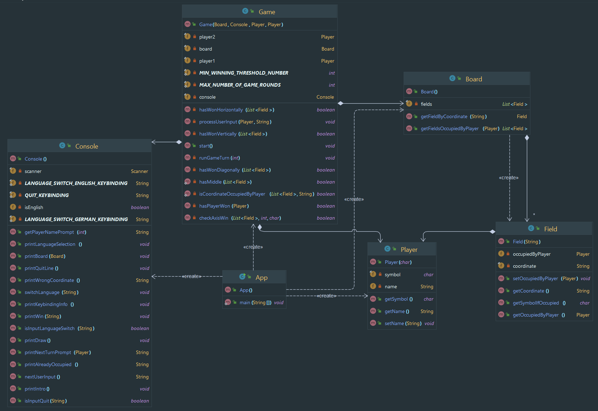

# Tic Tac Toe

A simple tic tac toe game with input and output via the console.

## Getting started

1. Open the repository in the IntelliJ IDE and navigate to the `App.java` file.
2. Click  `Run` next to the `Current File` option on the toolbar.

## Classdiagram

